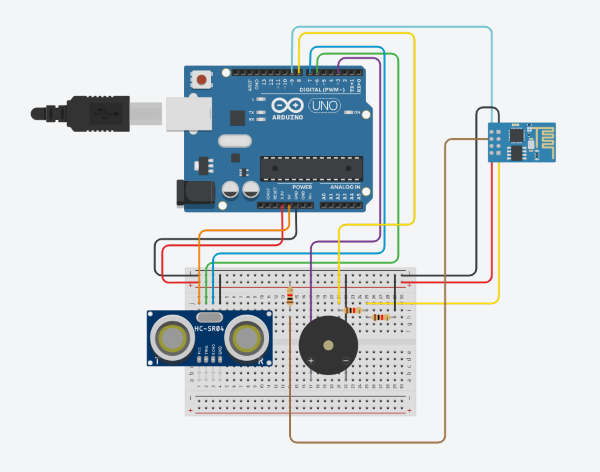
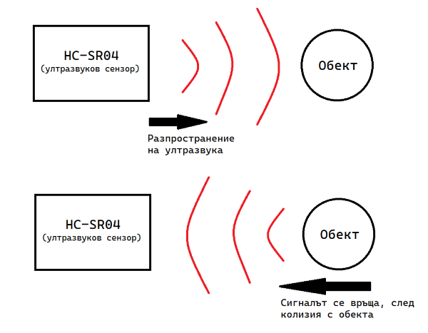
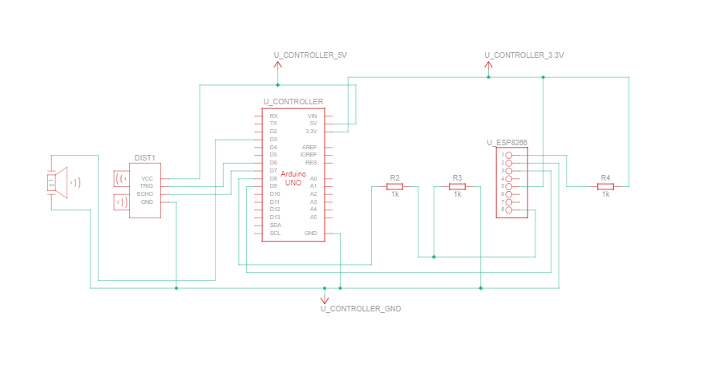

# ScruTINY

## Какво е ScruTINY?
ScruTINY е преносима система за защита, може да бъде поставена навсякъде, по всяко време. 
Тя е приспособена за безжична комуникация със собственика си.

## Начин на действие.
Работи, въз основа на връзка с външна Wi-Fi мрежа. Системата трябва първоначално да бъде
конфигурирана с компютър/лаптоп, за да може да осъществява връзка с дадена (по време на конфигурацията) 
Wi-Fi мрежа. ScruTINY осъществява предназначението си чрез засичане на движение. 
При смущаване на сензора на системата (засечено движение в стаята), тя изпраща информация за смута на 
[**онлайн сървър**](https://github.com/generot/ScruTINY-online), от който собственикът може да види пратената информация, независимо къде се намира на 
света (стига да има връзка с Интернет).

Освен това, се активира и звуковата аларма на системата, която се състои от един зумер 
(buzzer - високоговорител, който издава пищящ звук), с цел да разобличи 
случващото се на хора в периметъра.

## Как работи?
  
Чрез ултразвуков сензор, ScruTINY отчита всяко движение по път на ултразвуковия сигнал. В зависимост от колко време
е отнело на сигнала да се върне до сензора (след сблъсък с нещо по пътя си), ScruTINY изчислява разстоянието, на което
е човекът/обектът от самия сензорен модул.  
  
При засечено движение, ScruTINY изпраща известие за това смущение към профила
на собственика си (ако той има такъв) чрез ESP8266 Wi-Fi модула. Разстоянието се праща с една проста POST завка към сървъра,
директно към известията на притежателя си в сайта. Поради използването на socket-и за реализацията на сървъра, потребителят
получава обновления в реално време за всяко засечено движение. Още преди изпращането, ScruTINY алармира за случващото се през
вградения ѝ зумер(buzzer). Той работи на базата на [**пиезоелектричния ефект**](https://en.wikipedia.org/wiki/Piezoelectricity). 
Подава му се широчинно модулиран пулс от микроконтролера, който кара зумера да издава звук на дадена честота (зависеща от пулса).
Така използваме зумера за аларма на защитната система.

## Схема на проекта.

## Инструкции за стартиране на проекта
1) Уредът се конфигурира с помощта на лаптоп/компютър през USB порта му. Конфигурират се:
    - Wi-Fi мрежа, към която уредът да се свърже
    - Уникален идентификатор на притежателя, след регистриране в [**сайта**](https://github.com/generot/ScruTINY-online)
2) Подават се 9 V напрежение на буксата за захранване на уреда. Може да бъде всякакъв източник на захранване(батерия, зарядно и т.н.)
3) Готови сте! Вече проектът е готов за използване. Влизате си в профила на [ScruTINY сайта](https://github.com/generot/ScruTINY-online)
и можете да наблюдавате всеки един усет на движение пред уреда.

## Използвани технологии
Дадена е и хардуерната, и софтуерната технология.

### Хардуер
- [Arduino - микроконтролер](https://www.arduino.cc/)
- [ESP8266 - Wi-Fi модул](https://erelement.com/wireless/wi-fi-esp8266)
- [HC-SR04 - ултразвуков сензор](https://www.sparkfun.com/products/15569)

### Софтуер
- За микроконтролера
    - [WiFiEsp - библиотека за работа с Wi-FI модула(като shield)](https://github.com/bportaluri/WiFiEsp)

- За [**сървъра**](https://github.com/generot/ScruTINY-online)
    - [Heroku](https://www.heroku.com/)
    - [Flask](https://flask.palletsprojects.com/en/2.1.x/)
    - [Socket.IO](https://socket.io/)
    - [MongoDB](https://www.mongodb.com/)

## Автор на проекта
- Мартин Наков(10 клас)
